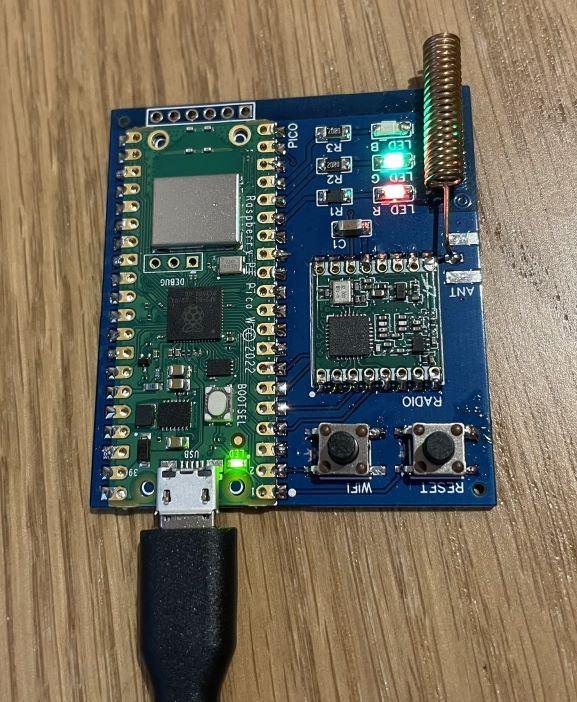
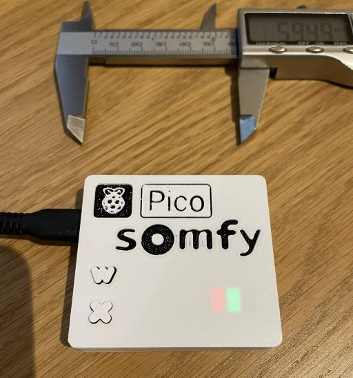
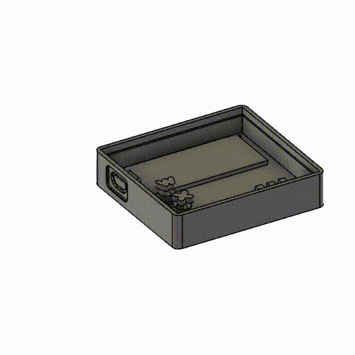

# Pico Somfy - What is that?

I found a way to get the RFM69HCW "packet mode" to produce packets that were compatible with the Somfy RTS protocol
This is the result of that experiment getting way out of hand:

Pico Somfy in a DIY hardware project for controlling Somfy Blinds in Home Assistant (or with MQTT/HTTP). It can be put together using a cheap Raspberry PI Pico W and an RFM69HCW module. You can put this together on a breadboard, but it's very very cheap to manufacture a prototype PCB now too.

The (my first) EasyEDA PCB layout is provided in the pcb folder. You can get 5 boards manufactured by JLC PCB about $5, delivered!

The Pi Pico W runs a small React web interface that lets you configure blinds and any additional remotes.
Blinds are exposed to Home Assistant through MQTT discovery as Covers. The position of the blinds are estimated
based on open/close timings.

Additional Remotes can be created, and bound to several blinds, to allow group control.
These are exposed to home assistant as buttons, not covers. Operating a remote will update the position of the associated covers.

With JLC PCB, total cost to manufacture the PCB and buy the parts is about £20.

## Parts

Required:
* [Pi Pico W](https://www.mouser.co.uk/ProductDetail/358-SC0918) - £4.80
* [RFM69HCW 433Mhz](https://www.mouser.co.uk/ProductDetail/474-COM-13910) - £4.99
* [Ceramic Capacitor](https://www.mouser.co.uk/ProductDetail/187-CL31A106KAHNNNE) - £0.06 (or you can buy the Adafruit breadboard module which includes the capacitor on-board)

Optional:
* Status LEDs
  * [Red](https://www.mouser.co.uk/ProductDetail/645-599-0220-007F) - £0.18 + [Resistor](https://www.mouser.co.uk/ProductDetail/71-CRCW1206220RFKEB) - £0.03
  * [Green](https://www.mouser.co.uk/ProductDetail/645-599-0281-007F) - £0.28 + [Resistor](https://www.mouser.co.uk/ProductDetail/71-CRCW120620R0FKEAC) - £0.03
  * [Blue](https://www.mouser.co.uk/ProductDetail/645-599-0291-007F) - £0.21 + [Resistor](https://www.mouser.co.uk/ProductDetail/71-CRCW120620R0FKEAC) - £0.03
* Tactile Switches x 2 - I bought ones with the wrong pins cross-connected. Oh well.
* There is a position for an edge-mount antenna connector. I couldn't find a cheap option to use, but a better
  antenna really isn't needed anyway. Any short bit of wire would probably do.

## Building the Firmware

* Open Visual Studio Code in the `firmware` folder. 
* From the terminal run `./generate_fsdata.sh`. This builds the web interface project, which is then squeezed onto the Pi Pico.
* Use the CMake plugin to build the project using the unspecified architecture. This will automatically use the Pico SDK.

## Installing the Firmware

Hold down BootSel while plugging in the Pi Pico W.
Copy the `somfy_remote.uf2` file from the `build/` directory to the Pico drive that appears.
If you need to update the firmware, you can re-enter firmware mode via the web interface too.

## Getting Started

When initially started for the first time, the pico starts in WiFi setup mode (green status LED shows).
It will appear as a WiFi access point called "pico_somfy". Connect to that access point with the password "password".

Go to http://192.168.4.1 to access the setup interface. Here you can select your Wifi network from the drop-down list
and enter your WiFi credentials so Pico Somfy can connect to your network. Note: Pi Pico only supports Wifi 2.4G.

Click Save & Reboot.

Pico Somfy should start up and connect to the Wifi network. You should see a pulsing red light.
If the light does not light, the WiFi connection could not be established. You can re-enter WiFi setup mode by pressing
Reset for a short press, and then holding the WiFi button for about 10 seconds during startup until the green LED
lights steadily.

Figure out what IP address your Pico Somfy has been assigned. You can get this from your router.
Go to the web interface at http://<your-pico-ip-here> to configure your Pico Somfy, and to connect to MQTT.

You can then go to the setup page to add your MQTT configuration settings. This is required for Home Assistant integration. If MQTT is connected, you will see a pulsing green status light.

Blinds can be added from the Control Blinds page. I reccomend you add a blind for each blind you want to control first
and then add additional remotes to group them together as required.

The Blind control page and interface is pretty rough around the edges, and not designed to be used for any
more than setting up the blinds and testing the functions. Use Home Assistant or the MQTT/HTTP API for control
and automation.

## Somfy Commands - For reference

To add a remote to a brand new blind (or after a factory reset), long press the up-down buttons.
This then enters the blind setup procedure where you can use various button combinations to set
the direction of the blinds and the blind limits.

To configure a blind that already has a remote associated with it, long-press the program button
on the existing remote. Then short-press the program button on the new blind's remote (see the ...
button on the blind controls). Some Somfy documentation says you need a long-press. This may be
true of some blinds, but not mine.

Adding additional remotes has a built-in bind/unbind feature in the web interface. Choose which
of your existing blinds you want the remote to control.

## Enclosure

I designed a simple 6cm x 6cm x 1.5cm square case to hold the circuit board and expose the buttons and status LEDs.

The Fusion 360 and STL files ca be found in the `case/` directory. Print the lid and buttons face-down.
No Supports are needed. I changed filament half way through printing the lid to make the recessed logo
stand out.

## Credits

This project relied heavily on the Somfy RTS protocol decoding which was done by [PushStack](https://pushstack.wordpress.com/somfy-rts-protocol/).

The original idea came from the Pi-Somfy project from [Nickduino](https://github.com/Nickduino/Pi-Somfy). This fantastic project is only let down by the unreliable radio module whose radio frequency would seemingly change with the weather.
I started trying out the RFM69 module instead, but ended up trying to control it from a £6 Pico W for what was
supposed to be "fun".

## License

MIT Open Source license.
